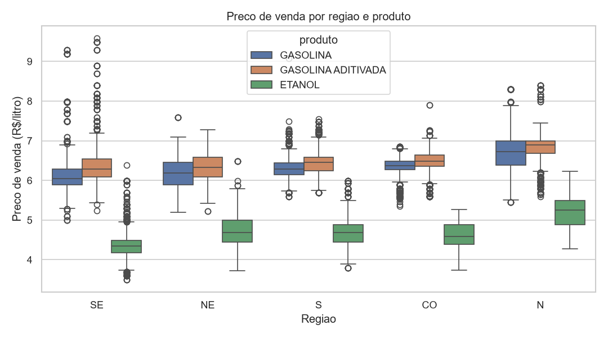
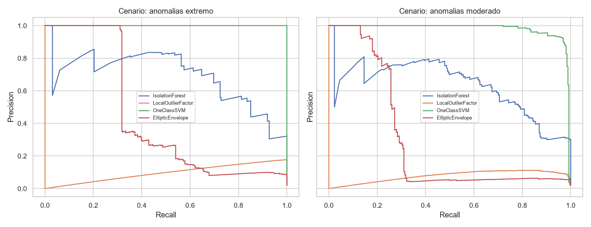
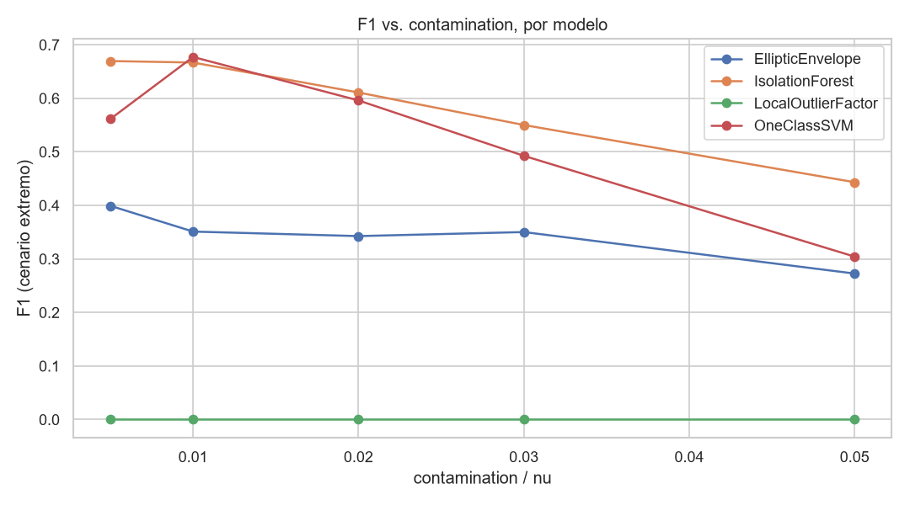

# ⛽ ANP Fuel Price Anomaly Detection

**Some gas stations in Brazil sell fuel at prices that don't make sense. This project finds them — without ever being told what "wrong" looks like.**

[](https://www.python.org/)
[](https://scikit-learn.org/)
[](https://pandas.pydata.org/)
[](https://jupyter.org/)
[-009c3b)](https://www.gov.br/anp/pt-br/centrais-de-conteudo/dados-abertos/serie-historica-de-precos-de-combustiveis)
[](https://ejunior029.github.io/anp-fuel-price-anomaly-detection/)

**🗺️ [See the live map →](https://ejunior029.github.io/anp-fuel-price-anomaly-detection/)** — refreshed automatically every month by a GitHub Actions workflow that scores the newest ANP release with the trained model. No server, no manual step.

---

## The hook

Every month, Brazil's oil & gas regulator (**ANP**) sends inspectors to tens of thousands of gas stations across the country and writes down what they charge for gasoline and ethanol. It's a massive, public, real-world dataset — and buried in it are stations charging prices that simply don't fit: a typo that turns R$ 6,79 into R$ 67,90, a station quietly charging double the regional rate, a data entry error nobody caught.

**Nobody labels these rows "anomaly."** There's no `is_fraud` column to train on. This project treats that as the actual problem worth solving: can we teach a handful of unsupervised algorithms to agree on what's normal for *this* fuel, in *this* state, and flag the handful of records that break the pattern?

Spoiler: yes — and the four algorithms we tried disagree with each other in genuinely interesting ways.

## TL;DR

| | |
|---|---|
| 🗺️ **Dataset** | 52,336 fuel price surveys, Dec/2025, all 27 Brazilian states, 3 fuel products |
| 🔬 **Approach** | Fully unsupervised — features engineered from price deviation vs. regional median |
| 🤖 **Models compared** | Isolation Forest · Local Outlier Factor · One-Class SVM · Elliptic Envelope |
| 🧪 **Evaluation trick** | Synthetic anomaly injection to get real precision/recall without a labeled dataset |
| 🏆 **Best result** | One-Class SVM — F1 ≈ **0.68**, recall = **1.00**, PR-AUC ≈ **1.00** |
| 😮 **Best plot twist** | LOF's score ranks anomalies well (ROC-AUC 0.91) but its default threshold flags **zero** of them |
| 🔴 **Live** | A [choropleth map](https://ejunior029.github.io/anp-fuel-price-anomaly-detection/) re-scores the newest ANP release automatically, every month |

## Why this dataset is a great anomaly-detection playground

Raw price alone is a trap. A R$ 6.50/liter gasoline price is *perfectly normal* in Acre and would be a screaming outlier in Piauí:

<p align="center">
  
</p>

The median price of gasoline swings from **R$ 5.79 in Piauí to R$ 7.39 in Acre** — a ~28% gap driven by freight cost and state taxes, not fraud. That single chart is the reason this project doesn't just threshold on price: every model is fed the **percentage deviation from the median price of the same state + product combination**, computed only on the training split, so the "normal" a model learns is always local, never global.

## The pipeline

```
01_EDA.ipynb                    → data quality, price distributions, regional gaps (no modeling)
        ↓
02_preprocessing_baseline.ipynb → leak-free split, feature engineering, IsolationForest baseline
        ↓
03_modelagem_comparacao.ipynb   → 4 models trained side by side, agreement analysis
        ↓
04_avaliacao_tuning.ipynb       → synthetic anomalies → real precision/recall → hyperparameter tuning
```

Every notebook opens with a plain-language intro explaining what it does and why it comes next, and every result table/chart is followed by a short interpretation — this repo is meant to be read, not just run.

## Key findings

- **Anomalies are genuinely rare.** Only 396 records (0.76%) sit beyond 3 standard deviations of their own state+product group — confirming this really is an imbalanced/rare-event problem, just without a ground-truth label to prove it.
- **Regional context matters more than the raw number.** The feature that made the biggest difference wasn't a clever model — it was comparing each price to its own state and product's median instead of the national one.
- **Models disagree at the margins, agree at the extremes.** All four flag roughly the same worst offenders, but a Jaccard-similarity heatmap (see `03_modelagem_comparacao.ipynb`) shows they diverge a lot in the gray zone near the decision threshold.
- **A model's default threshold can lie to you.** Local Outlier Factor's continuous score is genuinely informative (ROC-AUC ≈ 0.91), but its `contamination`-calibrated `predict()` output flagged **zero** synthetic anomalies. Looking only at the binary label would have written LOF off completely — the precision-recall curve told the real story:

<p align="center">
  
</p>

- **Lower `contamination` isn't just "safer" — it's usually better.** Across the tuning grid, F1 peaked at low contamination values (~1-2%, close to the true rarity of anomalies) and degraded as it increased:

<p align="center">
  
</p>

- **There's no free ground truth — so we built one.** Since ANP doesn't label anomalies, the evaluation notebook injects synthetic price anomalies (both extreme 2-4x distortions and subtler 1.3-1.8x ones) into the test set only, purely to compute honest precision/recall/PR-AUC without ever letting the training data see a fabricated anomaly.

## The live map

The notebooks are static — the map isn't. [**ejunior029.github.io/anp-fuel-price-anomaly-detection**](https://ejunior029.github.io/anp-fuel-price-anomaly-detection/) is a self-contained static page (inline SVG map of Brazil, no map-tile service, no external JS) that shows the current month's anomaly rate per state, the single worst offender in each one, and a national top-15 list.

```
GitHub Actions (cron, 5th of every month)
        ↓
src/pipeline_mensal.py  → downloads the newest ANP CSV
                         → scores it with the ALREADY-TRAINED models/*.joblib (no retraining)
                         → writes docs/dados/latest.json
        ↓
GitHub Pages serves docs/ → the map fetches latest.json client-side and colors itself in
```

No servers to babysit — it's a static file that gets rewritten once a month by a scheduled job and re-published by GitHub Pages. `workflow_dispatch` is also enabled, so it can be triggered on demand from the Actions tab instead of waiting for the 5th.

One honest caveat, stated on the page itself: states with few records (e.g. Acre, Amapá) get noisier percentages — a handful of stations can swing the rate a lot — and raw price is still one of the model's features, so historically expensive states can look more "anomalous" than they really are. Read it as a lead for investigation, not a verdict.

## Repository structure

```
Anomalias/
├── data/                    # raw + split CSVs (gitignored — see "Getting the data" below)
├── notebooks/
│   ├── 01_EDA.ipynb                     # exploratory analysis only, no modeling
│   ├── 02_preprocessing_baseline.ipynb  # leak-free split + features + IsolationForest baseline
│   ├── 03_modelagem_comparacao.ipynb    # 4 models compared side by side
│   └── 04_avaliacao_tuning.ipynb        # synthetic-anomaly evaluation + hyperparameter tuning
├── src/
│   ├── data.py             # load & clean the raw ANP CSV
│   ├── features.py         # ReferenciaPrecos (train-only medians) + preprocessing pipeline
│   ├── models.py           # the 4 anomaly detectors, built with comparable hyperparameters
│   ├── evaluation.py       # synthetic anomaly injection + precision/recall/F1/ROC-AUC/PR-AUC
│   └── pipeline_mensal.py  # monthly scoring script that feeds the live map (see below)
├── models/              # trained artifacts — mostly gitignored, EXCEPT the 3 files
│                        # pipeline_mensal.py depends on (referencia_precos, preprocessador,
│                        # melhor_modelo) — those are the deployed production model
├── docs/                # the live map: index.html + dados/latest.json, served by GitHub Pages
├── .github/workflows/   # atualizar_mapa.yml — the monthly GitHub Actions job
├── reports/             # generated charts and result tables (gitignored)
├── assets/              # curated charts checked into the repo, used in this README
└── requirements.txt
```

## Getting started

```bash
git clone https://github.com/ejunior029/anp-fuel-price-anomaly-detection.git
cd anp-fuel-price-anomaly-detection

python -m venv venv
venv\Scripts\activate        # Windows
# source venv/bin/activate   # macOS/Linux

pip install -r requirements.txt
jupyter notebook notebooks/
```

Run the notebooks in order — `01` through `04`. Each one saves what the next one needs (split data, fitted preprocessor, trained models), so nothing needs to be re-derived by hand.

### Getting the data

`data/` and `models/` are gitignored (raw data and trained models don't belong in git history). The dataset used here is ANP's public December 2025 gasoline/ethanol price survey — download it directly and drop it in `data/`:

```
https://www.gov.br/anp/pt-br/centrais-de-conteudo/dados-abertos/arquivos/shpc/dsan/2025/precos-gasolina-etanol-12.csv
```

Rename it to `precos_combustiveis_anp_2025-12.csv` (or update `CAMINHO_DADOS` in `01_EDA.ipynb`), and you're ready to go. Any other month from the [ANP historical series](https://www.gov.br/anp/pt-br/centrais-de-conteudo/dados-abertos/serie-historica-de-precos-de-combustiveis) works too — the pipeline doesn't hardcode anything month-specific.

## Tech stack

`pandas` · `numpy` · `scikit-learn` (IsolationForest, LocalOutlierFactor, OneClassSVM, EllipticEnvelope) · `matplotlib` / `seaborn` · `Jupyter`

## Ideas for what's next

- Extend the feature set with time (is this station's price drifting week over week?) instead of a single monthly snapshot.
- Try `HistGradientBoosting`-based novelty detection or an autoencoder reconstruction-error approach for comparison.
- Cross-validate the synthetic-anomaly evaluation across multiple injection seeds to get confidence intervals on F1, not just a point estimate.
- Retrain (not just re-score) periodically as more months accumulate, with a check that the new model doesn't silently regress on the synthetic-anomaly benchmark before it replaces `models/melhor_modelo.joblib`.
- Turn the single-point "worst case per state" into a small drill-down list (top 3-5) directly on the live map.

---

If you found the LocalOutlierFactor threshold story as interesting as I did, or have ideas for the next step, open an issue — I'd love to compare notes.
